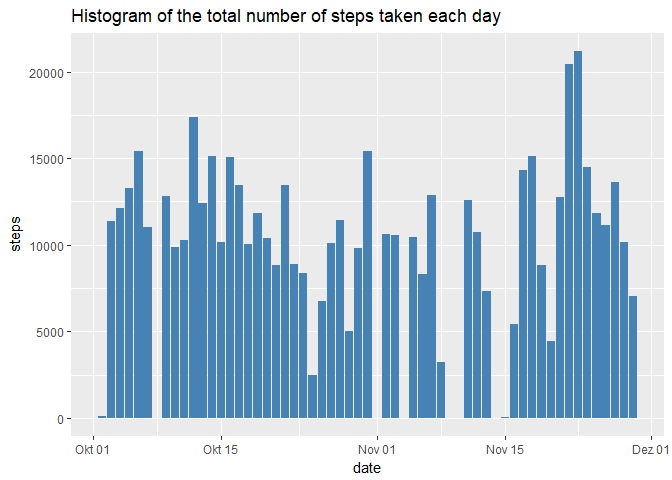
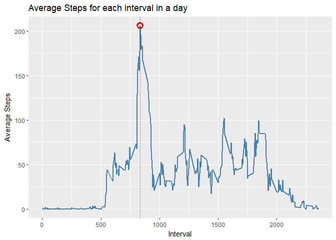
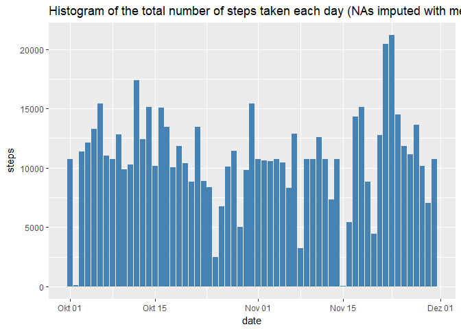
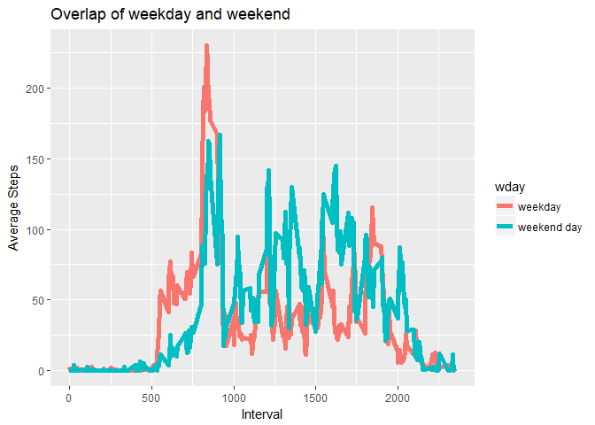
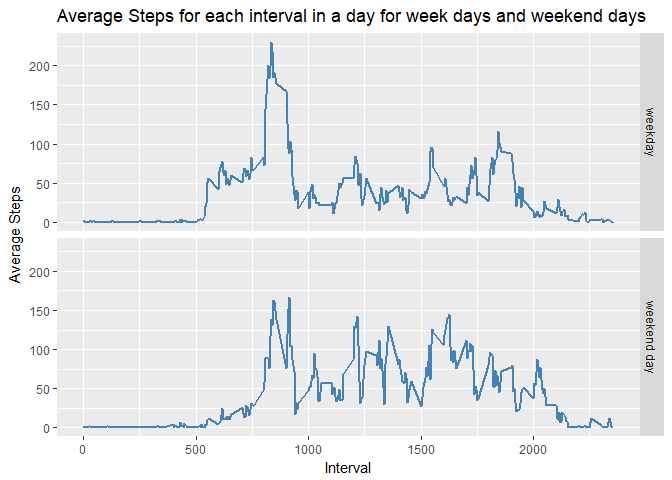

## Loading and preprocessing the data
First we have to load the ggplot2 library as well as the lubridate library that 
will be used to preprocess the date data from "activity.csv"


```r
library(lubridate)
library(ggplot2)
df <- read.csv("activity.csv")
df$date <- ymd(df$date)
```


## What is mean total number of steps taken per day?

```r
g <- ggplot(data = df, aes(x = date, y = steps))
g + geom_bar(stat = "identity",fill = "steelblue") + 
    labs(title= "Histogram of the total number of steps taken each day")
```

<!-- -->

```r
totalStepsPerDay <- aggregate(steps~date,df, sum)
meanStepsPerDay <- mean(totalStepsPerDay$steps)
medianStepsPerDay <- median(totalStepsPerDay$steps)
```
It can be clearly seen that the total number of steps per day varies greatly from day to day. Some of the days are missing because we did not record any data for that day so we will have to input in a later step the missing values.

The total number of steps is 570608 with a mean per day of 10766 and a median per day of 10765


## What is the average daily activity pattern?


```r
df2 <- aggregate(steps ~ interval,df, mean)
maxPoint <- df2[which.max(df2$steps),]
g <- ggplot(data = df2, aes(x = interval, y = steps))
g + geom_line(col = "steelblue", size = 1) + 
    labs(x = "Interval", y = "Average Steps",title = "Average Steps for each interval in a day") + 
    geom_point(data = maxPoint,aes(x=interval, y = steps), shape = 21, size = 3, color = "red", stroke = 2) + 
    geom_vline(xintercept = maxPoint$interval, linetype="dotted")
```

<!-- -->

Interval 835 has the max average steps of 206


## Imputing missing values
For all the days with missing values we will impute the mean number of steps for each interval


```r
totalNA <- sum(is.na(df$steps))
# Filling in the data
fill_NA_with_mean <- function(df1,df2 = df2){
    for(i in 1:nrow(df1)){
        if(is.na(df1[i,"steps"])){
            tmpInterval <- df1[i,"interval"]
            df1[i,"steps"] <- df2[df2$interval == tmpInterval, "steps"]
        }
    }
    return(df1)
}

df_full_values <- fill_NA_with_mean(df,df2)


totalStepsPerDay_new <- aggregate(steps~date,df_full_values, sum)
meanStepsPerDay_new <- mean(totalStepsPerDay_new$steps)
medianStepsPerDay_new <- median(totalStepsPerDay_new$steps)
```

The total amount of NA in the data is **2304**. After having imputed the NAs with the mean values for each interval we can calculate the new mean and median per day being mean: **10766** and median: **10766**. There is a difference in the mean of: 0 and a difference in the median of: 1. 

It is no surprise that the mean value remained the same since we imputed exactly that values in the NAs. As for the median it changed because there were more measures from which it calculated the median.

The new histogram of the data can be seen below. 


```r
# 
g <- ggplot(data = df_full_values, aes(x = date, y = steps))
g + geom_bar(stat = "identity",fill = "steelblue") + 
    labs(title= "Histogram of the total number of steps taken each day (NAs imputed with mean values)")
```

<!-- -->

## Are there differences in activity patterns between weekdays and weekends?


```r
df_full_values$wday <- wday(df_full_values$date) 
for(i in 1:nrow(df_full_values)){
    if(df_full_values[i,"wday"] %in% c(1,7)){
        df_full_values[i,"wday"] <- "weekend day"
    } else {
        df_full_values[i,"wday"] <- "weekday"
    }
}
df_full_values$wday <- as.factor(df_full_values$wday)

df3 <- aggregate(steps ~ interval + wday,df_full_values, mean)

g <- ggplot(data = df3, aes(x = interval, y = steps, group = wday, color = wday))
g + geom_line(size = 2) + 
    labs(x = "Interval", y = "Average Steps",title = "Overlap of weekday and weekend")
```

<!-- -->

```r
g <- ggplot(data = df3, aes(x = interval, y = steps))
g + geom_line(col = "steelblue", size = 1) + 
    labs(x = "Interval", y = "Average Steps",title = "Average Steps for each interval in a day for week days and weekend days") + 
    facet_grid(wday~.)
```

<!-- -->

There is a clear difference between the week day and weekend in the early intervals with the weekend not having many steps while the weekend is higher during the middle of the day
